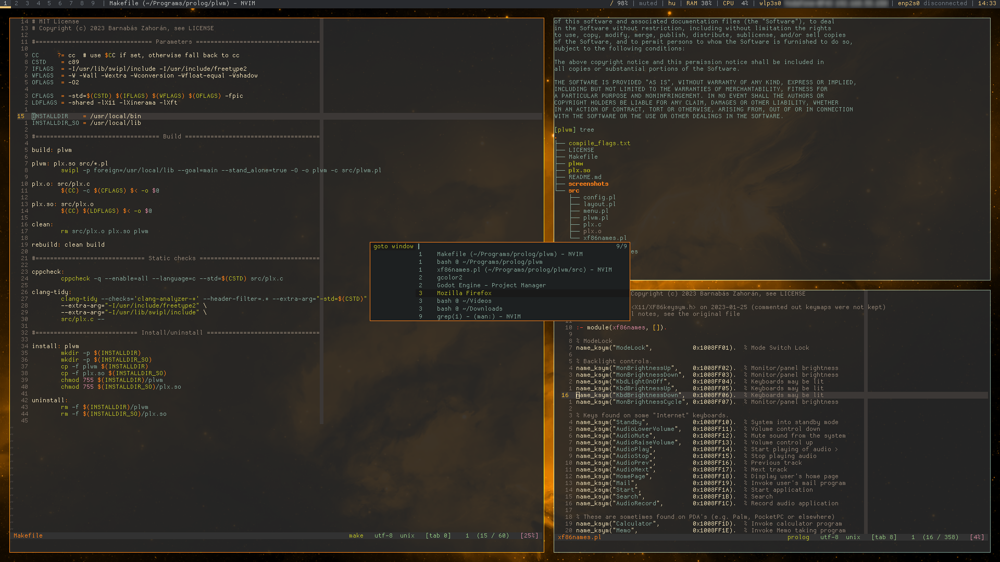

<!-- MIT License, Copyright (c) 2023 Barnabás Zahorán, see LICENSE -->

<p align="center">
  
</p>

# plwm - An X11 window manager written in Prolog

**Table of Contents**
- [About](#about)
- [Feature highlights](#feature-highlights)
- [Installation](#installation)
  - [Minimal environment](#minimal-environment)
  - [Using a display manager](#using-a-display-manager)
- [Usage](#usage)
  - [Basics](#basics)
  - [Default keybindings](#default-keybindings)
  - [Configuration](#configuration)
  - [External bars](#external-bars)
  - [Multi-monitor](#multi-monitor)
  - [Layout overrides](#layout-overrides)
  - [Rules](#rules)
  - [Menus](#menus)
  - [Scriptability](#scriptability)
- [Screenshots](#screenshots)
- [Project status](#project-status)
- [Contribution](#contribution)
- [FAQ](#faq)
- [Similar projects](#similar-projects)

# About

plwm is a highly customizable X11 dynamic tiling window manager written in [Prolog](https://en.wikipedia.org/wiki/Prolog), inspired by dwm.

Main goals of the project are: good code & documentation quality; powerful yet easy customization; to cover most common needs of tiling WM users; and to stay small, easy to use and hack on.

Powered by [SWI-Prolog](https://www.swi-prolog.org/)

# Feature highlights

* Source based like dwm: easy to hack on (small LOC), great way to introduce yourself to the logic programming paradigm and Prolog
* Easy to configure: Prolog is declarative, so even though the config is source code, it feels like a dedicated format
* Config is compiled in by default, but there is an option to also read it at startup for those who don't wish to recompile after each change
* Tiling is dynamic, with various layouts included by default: monocle, vertical/horizontal stacks, grid, left/right/top/bottom/centered master-stack, nrows(N), ncols(N)
* Floating windows are also supported (move/resize with mouse)
* Support for any number of external bars, e.g., polybar, lemonbar, xmobar
* Nice level of EWMH compilance: external bars work, dialogs, fullscreen and other size hints are recognized, etc. - **partially still work-in-progress**
* Dynamic workspace operations: create, rename, reindex or delete workspaces on the fly
* Misc features: multi-monitor support, adjustable tiling parameters, inner/outer gaps, menu integration with dmenu/rofi, rules, animations, command fifo and more
* Performance: plwm is fast and light as a feather when it comes to resource usage
* You can say: "My window manager is a semantic consequence of a set of axioms and implications which my computer is deducing/proving from an infinitely branching proof-tree"

# Installation

**Dependencies:**

* Xorg with libxft, libxinerama (including the X11 development headers)
* [SWI-Prolog](https://www.swi-prolog.org/Download.html) (most likely available from your distro's package repository)

On Ubuntu 22.04 you can install them with:

`$ sudo apt install swi-prolog libxinerama-dev libxft-dev`

Run:

`$ make && sudo make install`

By default, this will install plwm to `/usr/local/bin/`. The location can be adjusted in the [Makefile](Makefile).

## Minimal environment

Add the following line to the end of your `~/.xinitrc`:

`exec plwm`

Then simply use the command `startx` in tty.

For example, to automate this after logging in, put these lines in `~/.bash_profile` (or to whatever shell startup that matches your setup):

```bash
# Start X from login shell on tty1 if not already started
if [ -z "$DISPLAY" -a $(tty) = "/dev/tty1" ]; then
	exec startx
fi
```

## Using a display manager

Please refer to the documentation of your display manager on how to set up sessions for custom WMs.

[Here](https://wiki.archlinux.org/title/Display_manager) you can find good references for this.

For most modern display managers, you'll have to create a `/usr/share/xsessions/plwm.desktop` file with content like:

```ini
[Desktop Entry]
Name=plwm
Comment=This session logs you into plwm
Exec=plwm
Icon=path-to-this-repo/plwm/img/logo.png
Type=Application
```

# Usage

## Basics

If you have already used dynamic tiling WMs like dwm, then nothing should be too surprising in this section.

All windows are _managed_ by default. This means that whenever a window spawns, it will be added to a list. We call this list the _stack_. Also, the placement and the size of the windows are automatically calculated and set. This is determined by the currently active _layout_ (stack, horizontal stack, grid, etc.).

Some layouts are called "master-stack" layouts (the ones which have "master" in their names, e.g., `lmaster`). With these layouts the first `nmaster` number of windows (1 by default) in the stack go to a dedicated area. These are the _master windows_, which usually have the most space allocated for them. All other windows go to the remaining screen space.

For example, if you start plwm with the default config, you have: `layout = lmaster`, `nmaster = 1`, `mfact = 2/3`, which means that the stack's top window will always be on the left side and occupy 2/3 of the screen width, while the other windows will be in a secondary stack on the right having 1/3 of the screen width.

Some base promises of this approach:
* Declarative window management: you only _tell_ your system _what_ window arrangement you want and don't do the movement/resizing (don't need to care about the _how_ - lower cognitive load?)
* When new windows are spawned or old ones close, the layout will adapt automatically
* Playing with the `layout`, `nmaster`, `mfact` trio, one can cook up mostly any kind of arrangement a situation may need, just with a few keystrokes.
* 100% of the screen space is utilized at all times, 99% if you use gaps :)

## Default keybindings

| Keybind               | Predicate                         | Description                                                       |
| --------------------- | --------------------------------- | ----------------------------------------------------------------- |
| super + j             | `shift_focus(down)`               | Focus next window in stack                                        |
| super + k             | `shift_focus(up)`                 | Focus previous window in stack                                    |
| super + shift + j     | `move_focused(down)`              | Swap focused window with the next                                 |
| super + shift + k     | `move_focused(up)`                | Swap focused window with the preceding                            |
| super + Return        | `focused_to_top`                  | Move focused window to top of the stack                           |
| super + q             | `close_focused`                   | Close focused window                                              |
| super + shift + space | `toggle_floating`                 | Toggle between manual and automatic management of focused window  |
| super + f             | `toggle_fullscreen`               | Toggle fullscreen of focused window                               |
| super + shift + q     | `quit`                            | Quit plwm                                                         |
| super + i             | `change_nmaster(+1)`              | Increase number of master windows by 1                            |
| super + d             | `change_nmaster(-1)`              | Decrease number of master windows by 1                            |
| super + h             | `change_mfact(-0.05)`             | Remove 5% from the space of master area                           |
| super + l             | `change_mfact(+0.05)`             | Add 5% to the space of master area                                |
| super + shift + f     | `layout:set_layout(floating)`     | Switch to `floating` layout (all windows unmanaged)               |
| super + shift + m     | `layout:set_layout(monocle)`      | Switch to `monocle` layout (all maximized, one visible at a time) |
| super + shift + s     | `layout:set_layout(stack)`        | Switch to `stack` layout                                          |
| super + shift + h     | `layout:set_layout(hstack)`       | Switch to `hstack` (horizontal stack) layout                      |
| super + shift + g     | `layout:set_layout(grid)`         | Switch to `grid` layout                                           |
| super + shift + l     | `layout:set_layout(lmaster)`      | Switch to `lmaster` (left master) layout                          |
| super + shift + r     | `layout:set_layout(rmaster)`      | Switch to `rmaster` (right master) layout                         |
| super + shift + t     | `layout:set_layout(tmaster)`      | Switch to `tmaster` (top master) layout                           |
| super + shift + b     | `layout:set_layout(bmaster)`      | Switch to `bmaster` (bottom master) layout                        |
| super + shift + c     | `layout:set_layout(cmaster)`      | Switch to `cmaster` (central master) layout                       |
| super + Tab           | `toggle_workspace`                | Switch between last two workspaces                                |
| super + shift + Tab   | `toggle_hide_empty_workspaces`    | Toggle the `hide_empty_workspaces` setting                        |
| super + 1             | `switch_workspace('1')`           | Go to workspace '1'                                               |
| ...                   | ...                               | ...                                                               |
| super + 9             | `switch_workspace('9')`           | Go to workspace '9'                                               |
| super + p             | `switch_workspace(prev)`          | Go to previous workspace                                          |
| super + n             | `switch_workspace(next)`          | Go to next workspace                                              |
| super + shift + 1     | `move_focused_to_workspace('1')`  | Move focused window to workspace '1'                              |
| ...                   | ...                               | ...                                                               |
| super + shift + 9     | `move_focused_to_workspace('9')`  | Move focused window to workspace '9'                              |
| super + shift + p     | `move_focused_to_workspace(prev)` | Move focused window to previous workspace                         |
| super + shift + n     | `move_focused_to_workspace(next)` | Move focused window to next workspace                             |
| super + ,             | `switch_monitor(prev)`            | Switch to previous monitor                                        |
| super + .             | `switch_monitor(next)`            | Switch to next monitor                                            |
| super + shift + ,     | `move_focused_to_monitor(prev)`   | Move focused window to previous monitor                           |
| super + shift + .     | `move_focused_to_monitor(next)`   | Move focused window to next monitor                               |

**Tip:** `change_nmaster/1` and `change_mfact/1` can not only take deltas, but also exact values to assign. Omit the the `+` and `-` prefixes for this behavior.

**Tip:** For both `switch_workspace/1` and `move_focused_to_workspace/1`, you can also pass `prev_nonempty` and `next_nonempty` for switching/moving to the next _non-empty_ workspace. The former can be nice for cycling through only the relevant workspaces. The latter can also work well when using the `hide_empty_workspaces` setting. You can also pass workspace _indices_ instead of _names_. Use numbers starting from 1 **without single quotes** for this (of course, this only makes sense if you use different workspace names than the default '1'...'9').

**Tip:** There are two parametric layouts which have no default keybindings: `nrows(N)` and `ncols(N)`. You can use them if you wish to have layouts with fixed number of rows or columns. For example, you can add a line like:

```Prolog
super + shift + "T" -> layout:set_layout(ncols(3))
```

then you'll have a triple stack layout where your windows will be evenly spread and sized among the three columns (can be nice with wide monitors).

**Tip:** you can bind multiple (consecutive) actions to a single keystroke by writing a comma separated list of predicates enclosed in parentheses, i.e., `Keyes -> (Act1, Act2,...)`

## Configuration

Configuration is done by modifying [config.pl](src/config.pl) then recompiling with `make && sudo make install`.

plwm will also attempt reading configuration when it starts from the first file among
- `$XDG_CONFIG_HOME/plwm/config.pl`
- `$HOME/.config/plwm/config.pl`
- `/etc/plwm/config.pl`

if any exists, so users don't have to recompile each time if they don't wish to. Any values read from the runtime config will override the compiled in settings.

A custom path can be specified with the `-c` flag.

**Attention:** the module name in the runtime config must be `runtime_config`!

You can run:

`$ make mkconfig`

which takes `src/config.pl` and generates the runtime config from it. Then keep modifying the latter while leaving the former in the default state. Or you can use the source one as a stable config and the runtime one for experimental overrides...

While cooking your config, you can use the `-C` flag to quickly and easily check its validity.

`config.pl` is self-documenting with lots of comments, but here is a quick reference:

| Setting                    | Values _(default value)_                                        | Description                                     |
| -------------------------- | --------------------------------------------------------------- | ----------------------------------------------- |
| `default_nmaster`          | 0<= integer<br>**Default:** 1                                   | Initial number of master windows                |
| `default_mfact`            | 0.05 .. 0.95<br>**Default:** 2/3                                | Initial space percentage given to master area   |
| `default_layout`           | floating, monocle, stack, hstack, nrows(N), ncols(N), grid, lmaster, rmaster, tmaster, bmaster, cmaster<br>**Default:** lmaster | Layout to use by default |
| `attach_bottom`            | true or false<br>**Default:** false                             | Put new windows to bottom of the stack instead  |
| `border_width`             | 0<= integer<br>**Default:** 1                                   | Border width in pixels                          |
| `border_width_focused`     | 0<= integer<br>**Default:** 1                                   | Border width for focused window in pixels       |
| `border_color`             | hexa code or color name<br>**Default:** "white"                 | Border color                                    |
| `border_color_focused`     | hexa code or color name<br>**Default:** "blue"                  | Border color for focused window                 |
| `snap_threshold`           | 0<= integer<br>**Default:** 32                                  | Snap to screen border threshold in pixels while dragging windows |
| `outer_gaps`               | 0<= integer<br>**Default:** 0                                   | Space reserved around screen edge in pixels     |
| `inner_gaps`               | 0<= integer<br>**Default:** 0                                   | Space between adjacent tiled windows in pixels  |
| `workspaces`               | list of atoms in UTF-8, at least 1<br>**Default:** ['1','2','3','4,'5','6','7','8','9'] | Workspace names |
| `starting_workspace`       | an element from workspaces<br>**Default:** '1'                  | Starting workspace                              |
| `hide_empty_workspaces`    | true or false<br>**Default:** false                             | Hide names of inactive and empty workspaces from bars |
| `ws_format`                | string with a \~w **or**<br/>string with a \~d followed by a \~w<br>**Default:** "\~w"  | Format of empty workspaces on bars (~d = index, ~w = name) |
| `ws_format_occupied`       | string with a \~w **or**<br/>string with a \~d followed by a \~w<br>**Default:** "▘\~w" | Format of occupied workspaces on bars |
| `layout_default_overrides` | list of (Monitor, Workspace -> Nmaster, Mfact, Layout)<br>**Default:** [] | Overrides of the 3 values to specific monitors and/or workspaces (explained [here](#layout-overrides)) |
| `bar_class`                | the two strings from bar's WM_CLASS,<br/>query with [xprop(1)](https://linux.die.net/man/1/xprop)<br>**Default:** "polybar", "Polybar" | Space will be reserved for matching windows and they cannot be focused, resized, etc. |
| `bar_placement`            | follow_focus, static<br>**Default:** follow_focus               | Determines placement of external bars (explained [here](#layout-overrides)) |
| `startupcmd`               | string<br>**Default:** -                                        | Command to spawn at startup (e.g., for auto launching bars or compositors) |
| `fifo_enabled`             | true or false<br>**Default:** false                             | Whether to spawn a command FIFO<br>(explained [here](#scriptability)) |
| `fifo_path`                | string<br>**Default:** "/tmp/plwm_fifo"                         | Path of command FIFO                            |
| `menucmd`                  | list of strings<br>**Default:** ["dmenu", "-i", "-l", "20", "-p"] | Command and its arguments to use for menu operations |
| `animation_enabled`        | true or false<br>**Default:** false                             | Whether to animate window move/resize           |
| `animation_time`           | 0.0< float<br>**Default:** 0.2                                  | Time of the animation                           |
| `animation_granularity`    | 1<= integer<br>**Default:** 30                                  | Number of steps in animation interpolations     |
| `modkey`                   | shift, lock, ctrl, alt, mod2, mod3, super, mod5<br>**Default:** super | Key you must hold for mouse operations    |
| `scroll_up_action`         | callable term or 'none'<br>**Default:** switch_workspace(next)  | Action to perform on modkey + scroll up         |
| `scroll_down_action`       | callable term or 'none'<br>**Default:** switch_workspace(prev)  | Action to perform on modkey + scroll down       |
| `keymaps`                  | list of (Modifiers + Key -> Action)<br>**Default:** [see here](#default-keybindings) | Modifiers: see values at `modkey`<br/>Key: keycode, [usual X11 names](http://xahlee.info/linux/linux_show_keycode_keysym.html), or [special key](src/xf86names.pl)<br/>Action: callable term |
| `rules`                    | list of (Name, Class, Title -> Monitor, Workspace, Mode)<br>**Default:** [] | Auto place and configure matching windows (explained [here](#rules)) |

**Notes**

You can use multiple `startupcmd` lines if you want to spawn multiple commands at startup.

In `keymaps/1`, the callback predicates can be arbitrary shell commands using `shellcmd/1`, even whole commandlines (some examples are included in the [default config](src/config.pl)).

## External bars

First, you must specify `bar_class/2` based on the WM_CLASS properties of your bars, which you can find out using [xprop(1)](https://linux.die.net/man/1/xprop). Then you can both:
* manually start/close bars while plwm is already running
* automatically start bars using `startupcmd/1` in the config

`bar_placement/1` can take two values:
* `follow_focus`: space will be reserved for bars on all monitors and bars will always be moved to the focused monitor (this is the default behavior)
* `static`: space will only be reserved for bars in their respective monitors they occupy and no bar will be moved automatically. Placing bars to desired monitors is the responsibility of the user/external bar

Some bars (e.g., polybar) already support different labels for empty and occupied workspaces. The advantages of plwm's built-in `ws_format/1` and `ws_format_occupied/1` are:
* it works on more primitive bars as well
* it respects multi-monitor scenarios, i.e., it only considers the set of workspaces that belong to the active monitor - this is relevant only with `bar_placement(follow_focus)`

You can toggle your external bars with the following hacks (again, some bars may have their own IPC mechanizm for this, but these are bar agnostic solutions):

```Prolog
alt + b -> shellcmd("pkill polybar || polybar")
```

or if you use multiple bars (a top and a bottom polybar called "top" and "bot", for example), you can:

```Prolog
alt + b -> shellcmd("pkill polybar || (polybar top & polybar bot)")
```

or if you want the ability to separately toggle the bars, use something like:

```Prolog
alt + b         -> shellcmd("pkill -fx 'polybar top' || polybar top"),
alt + shift + b -> shellcmd("pkill -fx 'polybar bot' || polybar bot")
```

**Note:** if you are using polybar, **do not enable** its `override-redirect = true` setting (it can even crash plwm in some cases)! Reasoning: plwm itself handles all bars (anything that matches `bar_class`, not just polybar) the intended way: bars cannot be focused, grabbed, moved or resized; tiling windows will never cover them (but you can drag floating windows above them); fullscreen windows will always cover them.

## Multi-monitor

The multi-monitor concept in plwm is similar to dwm's: the set of workspaces is cloned for each monitor. So if you're using the default config with two monitors, then you'll have two times nine unique workspaces: '0/1', '0/2',..., '1/9'.

The `switch_monitor/1` and `move_focused_to_monitor/1` predicates can take many different values:

* `prev`/`next` will go to the previous/next monitor (these will wrap) - only these have keymaps by default
* `prev_nonempty`/`next_nonempty` will go to the previous/next _non-empty_ monitor (a monitor is considered empty if its currently displayed workspace is empty). If you use a lot of monitors, say six, it could be convenient to cycle through only the relevant, i.e., non-empty ones (these will wrap)
* `left`/`right`/`up`/`down` will go to the specified direction relative to the active monitor calculated from x/y screen coordinates (these won't wrap)
* An arbitrary screen number (indexed from 0). So if you use, let's say four monitors, you can also bind keys such as `switch_monitor(2)`, which will go to the 3rd one. If you have a consistent [xrandr(1)](https://man.archlinux.org/man/xrandr.1) setup, then you can refer to the screen numbers to write convinient key bindings for going to arbitrary monitors

You can also switch monitors by moving with the mouse between them. Likewise, windows can be dragged and dropped between monitors using the mouse.

## Layout overrides

The `default_nmaster`, `default_mfact` and `default_layout` settings can each be overridden for specific monitors and/or workspaces using `layout_default_overrides/5`.

Underscore at the monitor column means "all monitors" for that workspace, while underscore at the workspace column means "all workspaces" on that monitor.

Underscores at the nmaster, mfact and layout columns mean not to alter the default settings for those.

**Note:** a later override will overrule values of previous ones if there is an overlap.

Some examples:

```Prolog
layout_default_overrides([
%  monitor  workspace     nmaster  mfact   layout
  ( _    ,  '2'       ->  _     ,  _    ,  grid    ),
  ( 0    ,  _         ->  2     ,  1/2  ,  tmaster ),
  ( 1    ,  '3'       ->  _     ,  0.90 ,  _       )
]).
```

## Rules

You can apply custom rules to newly spawned windows that match one or more criteria. You can match the window's name, class and title. These are substring matches by default, but you can wrap them in `exact()` to force an exact match, or can write any of them as `_` to ignore those particular checks.

The `monitor` column takes a screen number, or you can leave it as `_`, which implies opening on the currently active monitor.

The `workspace` column takes a workspace name (use single quotes), an index (from 1) or you can leave it as `_`, which implies opening on the currently active workspace.

The `mode` column can take the following values:
- `managed`: Window will be managed (`_` also implies this)
- `floating`: Window will be unmanaged, i.e., floating
- `[X, Y, W, H]`: Same as `floating`, but also apply this geometry:
    - `X` can be `left`, `right`, `center`, an integer coordinate, a percent (0.0..1.0) of x axis
    - `Y` can be `top`, `bottom`, `center`, an integer coordinate, a percent (0.0..1.0) of y axis
    - `W` can be an integer size or a percent (0.0..1.0) of screen width
    - `H` can be an integer size or a percent (0.0..1.0) of screen height
    - also, any of them can be left as `_` to keep the value the window spawned with
- `fullscreen`: Window will open in fullscreen mode

**Note:** if a window matches multiple rules, the first will be applied.

Some examples:

```Prolog
rules([
% name    class      title             monitor  workspace  mode
( _    ,  _       ,  exact("Foo")  ->  _     ,  '9'     ,  [right, top, _, _]         ),
( _    ,  _       ,  "Foo",        ->  _     ,  _       ,  [center, center, 1/3, 1/3] ),
( _    ,  _       ,  "FooBar"      ->  0     ,  _       ,  managed                    ),
( "Bar",  "Baz"   ,  _             ->  1     ,  'www'   ,  fullscreen                 )
])
```

You can find out the `name`, `class` and `title` values of windows using [xprop(1)](https://linux.die.net/man/1/xprop):

WM_CLASS(STRING) = name , class<br>
WM_NAME(STRING)  = title

**Tip:** if you want to apply a rule to a terminal application, then you'll need to use a terminal emulator that allows you to predefine the window class or title (most of them do). For example, alacritty has the `--class` and st has the `-c` flag for this:

```prolog
shellcmd("alacritty --class cmus -e cmus")
```

then you can match it with with a rule like:

```prolog
("cmus", "cmus", _ -> 0, '9', managed)
```

## Menus

The `menu` module is fully optional, but there are keybindings for it too by default:

**Navigation/window placement**

| Keybind         | Predicate                | Description                                                   |
| --------------- | ------------------------ | ------------------------------------------------------------- |
| alt + w         | `menu:goto_window`       | List windows from all monitors/workplaces, go to monitor/workspace of selected, then raise and focus the window |
| alt + shift + w | `menu:goto_workspace`    | List monitors/workspaces, except current, then go to selected |
| alt + p         | `menu:pull_from`         | List windows from all monitors/workspaces, except current, then pull selected ones to the active monitor/workspace and focus it |
| alt + shift + p | `menu:push_to`           | List monitors/workspaces, except current, then push the focused window to the selected |
| alt + q         | `menu:close_windows`     | Close selected windows                                        |
| alt + shift + q | `menu:keep_windows`      | Close all windows other than the selected                     |

**Dynamic workspace operations**

| Keybind         | Predicate                | Description                                                   |
| --------------- | ------------------------ | ------------------------------------------------------------- |
| alt + c         | `menu:create_workspace`  | Prompt for a name and append it to the list of workspaces     |
| alt + r         | `menu:rename_workspace`  | Prompt for a name and rename the active workspace to it       |
| alt + i         | `menu:reindex_workspace` | List possible workspace indices and move the active one to the selected index |
| alt + d         | `menu:delete_workspaces` | List workspaces and delete the selected ones (its windows, if any, will be moved to the next workspace) - **Note:** deleting is not allowed if only one workspace is left |

**Extras**

| Keybind         | Predicate                | Description                                                   |
| --------------- | ------------------------ | ------------------------------------------------------------- |
| alt + shift + k | `menu:list_keymaps`      | List all defined keymaps, their mapped actions, descriptions of said actions and execute the selected. Useful for early discoverability or running forgotten or rarely used mappings |
| alt + shift + c | `menu:list_cmds`         | List all available commands (i.e., predicates intended to be called by the user) and their descriptions, then execute the selected. Again, adds discoverability for new users. Can also be useful to run rare commands which have no mappings defined or even custom logic hacked into plwm (you'll need to add your predicates to `menu:list_cmds/0` and `menu:cmd_desc/2`) |

These predicates need `menucmd/1` set in the config to a program like [dmenu](https://tools.suckless.org/dmenu/) or [rofi](https://davatorium.github.io/rofi/). For example:

```Prolog
menucmd(["dmenu", "-i", "-l", "20", "-p"]).
```

or

```Prolog
menucmd(["rofi", "-dmenu"]).
```

**Note:** A prompt name will be written as last argument for `menucmd/1`, so if you are using dmenu, you should add `-p` as final argument.

**Note:** `pull_from`, `delete_workspaces`, `close_windows` and `keep_windows` can operate on multiple selections. Use Ctrl+Enter in dmenu, or Shift+Enter with `-dmenu -multi-select` in rofi.

## Scriptability

If `fifo_enabled/1` and `fifo_path/1` are both set (disabled by default), then a named pipe will be created (with [mkfifo(1)](https://www.man7.org/linux/man-pages/man1/mkfifo.1.html)).

The user can execute any term or list of terms by writing their code to this pipe.

For most usecases, predicates listed by `menu:list_cmds/0` are the ones users would be interested in calling, but note that this mechanizm can execute _arbitrary_ terms. Even internal ones, or custom ones the user hacks together. There is no limit.

In case of an issue (e.g. syntax error, predicate does not exist,...), the error will be written to the plwm log.

Examples:

Switch to the next workspace.
```bash
echo "switch_workspace(next)." > /tmp/plwm_fifo
```

Create a new workspace 'temp', switch to it and set its layout.
```bash
echo "create_workspace(temp),
      switch_workspace(temp),
      layout:set_layout(grid)." > /tmp/plwm_fifo
```

Use conjunction (comma) if you need to share variables between terms.
```bash
echo "Ws = temp. create_workspace(Ws). switch_workspace(Ws)." > /tmp/plwm_fifo # doesn't work
echo "Ws = temp, create_workspace(Ws), switch_workspace(Ws)." > /tmp/plwm_fifo # works
```

You can write reusable script files like:
```Prolog
% switch to first monitor
switch_monitor(0),

% create some workspaces
Workspaces = [a, b, c],
forall(member(Ws, Workspaces), (
    create_workspace(Ws)
)).
```
and simply execute them with:
```bash
cat myscript.pl > /tmp/plwm_fifo
```

Create workspaces '1'..'9'.
```bash
# this may yield inconsistent results (terms missing or in wrong order)
for i in {1..9}; do
    echo "create_workspace($i)." > /tmp/plwm_fifo
done

# instead send the whole input at once like before
for i in {1..9}; do
    echo "create_workspace($i)."
done > /tmp/plwm_fifo
```

# Screenshots

|  |
|:--:|
| *default appearance* |

|  |
|:--:|
| *lmaster / nmaster=1 / mfact=2/3 / 1px borders / 18px inner & outer gaps / goto window menu / polybar / picom / gruvbox colors* |

# Project status

**!!! Disclaimer:** plwm is still in an experimental state. First stable release will be v1.0. While crashes or other major bugs don't really occur, it's good to keep this in mind **!!!**

Also, this means that breaking changes (e.g. renaming of settings) are to be expected before reaching v1.0. We plan on switching to [semantic versioning](https://semver.org/) from that point onwards.

For known problems, see [the Issues with bug labels](https://github.com/Seeker04/plwm/issues?q=is%3Aopen+is%3Aissue+label%3Abug).

# Contribution

First and foremost, if you find any bugs, please create a GitHub issue, preferably, with all details you can provide. (First, please check if it's not reported already).

If you have a feature request, please do the same.

Any code contribution is also welcome. Especially if it solves some known issue. For brand new ideas, I recommend creating an issue first, so we can discuss it.

# FAQ

**Why yet another dwm clone?**

Why not? It was a good challenge, a nice learning experience and a lot of fun to implement a WM using logic programming and Prolog. It's also kind of a proof of concept and advertisement of Prolog.* It was suprisingly easy and fast to develop.

Also, if you read through this page all the way here, you surely see it's less a of a"direct clone" and more of a "spiritual successor".

\*This project is probably not the best example for all the strengths of logic programming. A lot of it is written in a more "imperative style" using global variables (kind of a domain requirement for window managers). If you want to see usecases that align better with logic programming, start [here](https://www.youtube.com/watch?v=8XUutFBbUrg).

**But isn't SWI-Prolog non-ISO compliant?**

Interoperability between different Prolog implementations was never really on the table. Their C FFIs are also different, so [plx.c](plx.c) would also need to be rewritten for each kind of Prolog. SWI-Prolog is arguably one of the most popular free and community-driven Prolog implementations, is easily accessible, has good documentation, some LSP support and a lot of libraries. Though, to be honest, plwm's code mostly sticks to fundamentals, so if someone really wanted to, it shouldn't be too hard to port this to another Prolog system...

**What about performance? Isn't Prolog slow?**

Compared to what? C? Yes. Does it matter? No. I've been using dwm for 6 years, so I have a good idea of its speed, and when I switch to plwm, it feels **exactly** as snappy... on my 6 years old laptop. So I don't think, anyone will see a notable difference.

**Why workplaces instead of tags?**

Tags is a cool generalization of workspaces, but I never actually utilized them for more than simple workspace usage. That's why I went with the simpler approach.

**Why not Wayland?**

A Wayland port some day is not out of the realm of possibilities...

**Some windows display all grey without contents!**

It is a known issue for Java applications which use the XToolkit/XAWT backend (e.g., UMLet). There is an excerpt from dwm's manual about it in plwm(1). Adding
```bash
export _JAVA_AWT_WM_NONREPARENTING=1
```
to your `.xinitrc` should solve this problem.

**plwm doesn't start! What's going on?**

Most likely your configuration is faulty. Run plwm with the `--check` flag, i.e.:

`$ plwm -C`

then you should see the problem.

If you don't see a config error, then please report it as an issue. Preferably by attaching any message plwm dumps to stderr or to its logfile with `-l`.

**How do I debug this?**

You can use the above mentioned `-l` flag with `writeln/1` and `format/2` calls to dump messages.

You can also use the `utils:dumpstack/0` predicate to manually dump the stack at any given point.

For more sophisticated debugging, replace the `exec plwm` line in your `.xinitrc` with an `exec <terminal-you-use>`, then after starting X, run:

```bash
swipl -p foreign=/usr/local/lib src/plwm.pl
```

From the toplevel you can use `trace/0` or `debug/0` to start debugging and then `main/0` to start stepping through plwm. Or use `spy/1` for placing breakpoints... You can learn more about the interactive debugger starting from [here](https://www.swi-prolog.org/pldoc/man?section=debugoverview).

If you wish to peek into the X11 bindings in plx.c, then you can add `-g` to `CFLAGS` in the Makefile, recompile, then use `attach <PID>` in `gdb` as root.

**Something is missing...**

plwm is minimal in the sense that it doesn't try to solve problems outside of a window manager's domain, especially if they are easily served by other programs (see [here](https://en.wikipedia.org/wiki/Unix_philosophy)):

* Don't want a status bar? You're set. Want one (or more)? Here are a few: [polybar](https://polybar.github.io/), [lemonbar](https://github.com/LemonBoy/bar), [xmobar](https://codeberg.org/xmobar/xmobar)
* Want transparent windows or other effects? Use a compositor like [picom](https://wiki.archlinux.org/title/Picom)
* Want tabbed windows? Use [tabbed](https://tools.suckless.org/tabbed/)
* Program launcher? [dmenu](https://tools.suckless.org/dmenu/) or [rofi](https://davatorium.github.io/rofi/) will get you covered
* Auto hide cursor? Try [unclutter](https://wiki.archlinux.org/title/Unclutter)
* Wallpaper? Many image viewers can set it, [feh](https://wiki.archlinux.org/title/Feh) for example
* Screen locker? Check out [slock](https://tools.suckless.org/slock/)
* plwm offers some basic rule based automation, but if you want more scriptability, try [xdotool](https://man.archlinux.org/man/xdotool.1.en) and [devilspie](https://linux.die.net/man/1/devilspie)

# Similar projects

* [tinywm](https://github.com/mackstann/tinywm): plwm's very first working version was basically tinywm, but in Prolog.
* [dwm](https://dwm.suckless.org/): Later, features and even implementation tricks were taken from dwm.

Thanks to both of these projects for inspiration and code to learn from!

Some other similar projects:

* [xmonad](https://xmonad.org/)
* [i3](https://i3wm.org/)
* [bspwm](https://github.com/baskerville/bspwm)
* [awesomewm](https://awesomewm.org/)

and here's a [longer list](https://wiki.archlinux.org/title/Comparison_of_tiling_window_managers).

