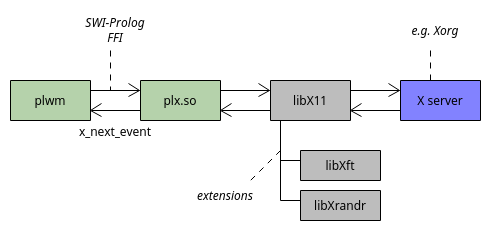

<!-- MIT License, Copyright (c) 2023-2025 Barnabás Zahorán, see LICENSE -->

# plwm - Development Guide

This page serves as a guide and manual for anyone who wishes to contribute to plwm.

**Table of Contents**
- [Tools](#tools)
- [Architecture](#architecture)
- [Coding rules](#coding-rules)
- [Debugging](#debugging)
- [Testing](#testing)
- [Commits](#commits)
- [Pull requests](#pull-requests)
- [Versioning and releases](#versioning-and-releases)

# Tools

**Languages**
* Languages:
  * [SWI-Prolog](https://www.swi-prolog.org/)
  * [C](https://www.c-language.org/) (for bindings to X11 libraries, provided by plx.so)
* Scripts and utilities: [Bash](https://www.gnu.org/software/bash/)
* Documentation: [GitHub Markdown](https://docs.github.com/en/get-started/writing-on-github/getting-started-with-writing-and-formatting-on-github)

**Libraries**
* [libX11](https://www.x.org/releases/current/doc/libX11/libX11/libX11.html)
* [libXft](https://www.freedesktop.org/wiki/Software/Xft/)
* [libXrandr](https://www.x.org/wiki/libraries/libxrandr/)

**Misc**
* Build: [GNU Make](https://www.gnu.org/software/make/)
* Code analysis: [clang-tidy](https://clang.llvm.org/extra/clang-tidy/), [cppcheck](http://cppcheck.net/)
* Version control: [git](https://git-scm.com/)
* CI: [Docker](https://www.docker.com/), [GitHub Actions](https://docs.github.com/en/actions)

# Architecture

plwm is an [X client](https://en.wikipedia.org/wiki/X_Window_System) serving the task of a window manager.



After initializations, plwm starts an event loop `eventloop/0` which polls for X events by infinitely calling `XNextEvent()` through `plx:x_next_event/2`.

User interaction is possible by three methods:
* Keymaps/mouse
* Menus
* Command fifo

| Module                              | Description                               |
| ----------------------------------- | ----------------------------------------- |
| [plwm.pl](../src/plwm.pl)           | entry point, event loop and wm logic      |
| [animation.pl](../src/animation.pl) | window animations                         |
| [fifo.pl](../src/fifo.pl)           | command fifo implementation               |
| [layout.pl](../src/layout.pl)       | layout definitions                        |
| [menu.pl](../src/menu.pl)           | menu commands                             |
| [setting.pl](../src/setting.pl)     | settings related predicates               |
| [utils.pl](../src/utils.pl)         | common utilities used by multiple modules |
| [xf86names.pl](../src/xf86names.pl) | definitions for special keys              |
| [plx.c](../src/plx.c)               | libX11 bindings                           |

**Threading:**

plwm uses threads in two cases:
* **Window animations:** `XMoveResizeWindow(3)` interpolation with `XSync(3)` calls for flushing the X event queue.
* **FIFO:** plwm polls for incoming commands on the fifo. Fills the `jobs/1` dynamic predicate with the list of command terms read from the pipe and sends a `ConfigureNotify` X event to notify the main thread of the waiting jobs. So they get processed on the main thread in-between X events sparing us from race conditions or similar issues.

**Global state:**

plwm uses both dynamic predicates and [SWI-Prolog globals](https://www.swi-prolog.org/pldoc/man?section=gvar).

Reasons:
* Globals cannot be shared between threads (thus `jobs/1` is a dynamic predicate).
* Globals are more performant, mostly for larger data.
* Modifying globals has a nicer syntax than dynamic predicates (`retract/1` followed by `assertz/1`).
* Query is nicer with dynamic predicates.

Our usage:
* Anything that stores an [association](https://www.swi-prolog.org/pldoc/man?section=assoc) is a global.
* Anything that is changed often is a global.
* Things set just once (during init) and only queried later are usually dynamic predicates (e.g. `display/1`).

# Coding rules

Rules:

* All predicates _must_ have [SWI-Prolog style structured comments](https://www.swi-prolog.org/pldoc/doc_for?object=section(%27packages/pldoc.html%27)) that shows determinism, arity, and type & mode indicators for arguments.
* Hard to understand code _should_ be commented to show its intent.
* All new predicates _should_ have unit tests. Both positive (success) and negative (failure) cases if applicable.
* Global variables and dynamic predicates _must_ have documentation comments explaining their purpose.
* Global variables and dynamic predicates _should_ be used as sparingly as possible.
* Predicates _should not_ be exported, instead use module prefixes (only exceptions are excessively used ones like `global_value/2`).
* plx.c _must not_ contain wm logic, only bindings to the X libraries with necessary helper functions.
* All `PL_*` FFI calls that can fail _must_ be wrapped in the `PL_TRY` macro.
* New features or changes affecting usage _must_ always be documented in the relevant readme.
* Indentation, spacing, structure, etc. of the existing code _must_ be followed in general.

# Debugging

You can use `-l` flag with `writeln/1` and `format/2` calls to dump messages.

You can also use the `utils:dumpstack/0` predicate to manually dump the stack at any point in the code.

For more sophisticated debugging, replace the `exec plwm` line in your `.xinitrc` with `exec <terminal-you-use>`, then after `startx`, run:

```bash
swipl -p foreign=/usr/local/lib src/plwm.pl
```

From the toplevel you can use `trace/0` or `debug/0` to start debugging and then `main/0` to start stepping through plwm. Or use `spy/1` for placing breakpoints... You can learn more about the interactive debugger starting from [here](https://www.swi-prolog.org/pldoc/man?section=debugoverview).

If you wish to peek into the X11 bindings in plx.c, then you can add `-g` to `CFLAGS` in the [Makefile](../Makefile), recompile, then use `attach <PID>` in `gdb` as root.

# Testing

All tests and validation related tools go under [tests/](../tests).

* [check_all.sh](../tests/check_all.sh) verifies the build & install integrity, runs static code analyzers, unit tests, etc.
* [run_unit_tests.sh](../tests/run_unit_tests.sh) executes all unit tests. Must be run from the project root or with `make test`.
* [get_coverage.sh](../tests/get_coverage.sh) calculates predicate coverage. If a predicate has at least one test, it's considered covered.

Unit tests reside in [tests/unit_tests/](../tests/unit_tests). They are grouped by modules and must have `.plt` extension, e.g. `utils.plt` tests `utils.pl`.

They are written using SWI-Prolog's [PlUnit](https://www.swi-prolog.org/pldoc/doc_for?object=section(%27packages/plunit.html%27)) package.

**Note:** you can run unit tests of a single module like this:

```bash
swipl -g run_tests -t halt tests/unit_tests/utils.plt
```

**Important:** Every new revision of plwm must give an "All checks PASSED" result from check_all.sh to be accepted. To be precise, it must succeed in our `ubuntu:latest` [Docker image](../Dockerfile).

You can build and run it with these commands:

```bash
DOCKER_BUILDKIT=1 sudo docker build -t plwm:latest .
sudo docker run plwm:latest
```

The same will run in the CI on a ubuntu-latest GitHub Action server after every push/pull request creation.

**Note:** it's recommended to periodically clean up old Docker volumes, containers, etc. to reclaim disk space. Easiest method is with this command:

```Bash
sudo docker system prune --volumes
```

# Commits

* Commit messages _should_ be brief, preferably under 80 characters, albeit descriptive.
* They _must_ include issue numbers _if_ they are related to some issue(s) in this format:
```
Commit message (#42)
Commit message with two issues (#42, #43)
```

# Pull requests

Two criteria must be met before a PR can be merged:
1. It passed the CI check (see [Testing](#testing))
2. It's been approved by a Maintainer

We use [rebasing](https://docs.github.com/en/get-started/using-git/about-git-rebase) as merge method to keep a clean linear history.

If it solves some issue(s), e.g. no. 1 and 2, the description must have `Closes #1. Closes #2.`

New contributors will be asked if they wish to be included in [AUTHORS](../AUTHORS).

# Versioning and releases

plwm is currently in a pre-release stage.

Now we simply increment a `0.x` version every 4-6 months.

Current process:
* Increment `version/1` in [plwm.pl](../src/plwm.pl).
* Update [CHANGELOG.md](../CHANGELOG.md) with changes since the latest version based on commit history.
* Create "Version bump to 0.x" commit.
* Create `v0.x` git tag.
* Push commit and tag.
* Create a [new release](https://github.com/Seeker04/plwm/releases/new) from the tag.
  * Name: "plwm v0.x"
  * Assets: `plwm-v0.x-linux-x86_64.tar.gz` with `bin/plwm` and `lib/plx.so` extracted from a Docker build
  * Description:
```
Version 0.x

See [CHANGELOG.md](CHANGELOG.md)

Note: Experimental release (first stable version will be 1.0.0)
```

Our first stable version will be `1.0.0` and from that point we're switching to [semantic versioning](https://semver.org/).

